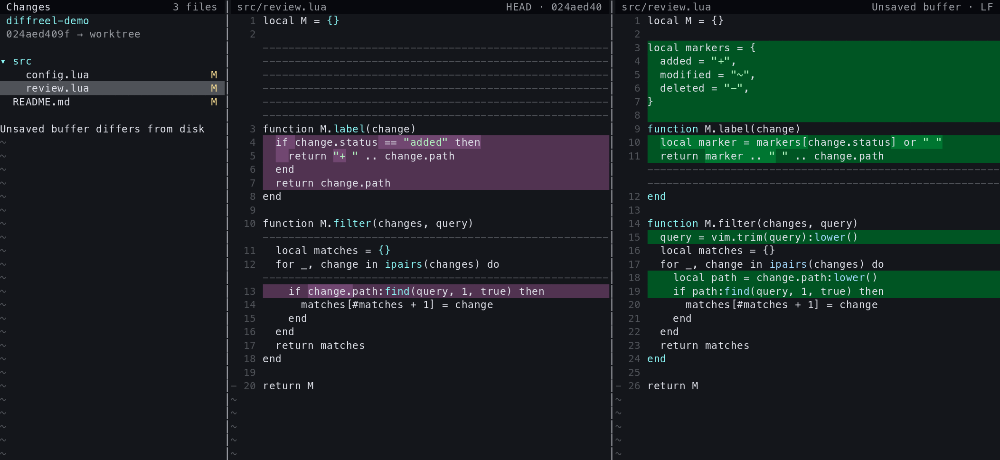

# diffreel.nvim

Review a changing Git worktree without leaving your editing environment.

diffreel pairs a file explorer with Neovim's native diff. The working-tree pane is a normal file buffer: keep editing, use your configured LSP, and follow changes made by other tools. Unsaved edits stay in your buffer when the file changes on disk.



## Why diffreel?

- **Review and edit together.** Use native diff navigation, folds, and your existing language tools in the working-tree buffer.
- **Choose your layout.** Switch between side-by-side, stacked, and inline views while keeping the same working-tree buffer.
- **Follow ongoing changes.** Filesystem monitoring updates the review as you, a formatter, a generator, or an AI coding tool changes files.
- **Keep unfinished edits.** External writes, deletion, and file switching preserve unsaved text; the review indicates when buffer and disk differ.
- **Choose your comparison.** Review the worktree, staged or unstaged changes, two revisions, or changes since a merge base. Limit each review to selected paths.

The Lua interface uses a Rust daemon for Git reads and monitoring. Prebuilt binaries install automatically; using the plugin does not require Rust, Cargo, Nix, or Deno. Deno runs the repository's development tools and tests.

## Requirements

| Component | Requirement |
|---|---|
| Neovim | 0.12 or newer |
| Git | 2.55 or newer, on Neovim's PATH |
| macOS | 14 or newer; Apple Silicon or Intel |
| Linux | arm64 or x86_64; the daemon uses static musl |
| Downloads | `curl` for anonymous HTTPS downloads |
| GitHub PR review | Authenticated GitHub CLI (`gh`); optional for local comparisons |
| Path copying | A Neovim clipboard provider; optional for other features |

Windows is not supported. File icons are optional and use `nvim-web-devicons` when it is installed. LSP support uses your existing Neovim configuration.

## Install

### lazy.nvim

Add this plugin specification to your lazy.nvim configuration:

```lua
{
  "wadackel/diffreel.nvim",
  name = "diffreel.nvim",
  main = "diffreel",
  cmd = {
    "Diffreel", "DiffreelClose", "DiffreelRefresh",
    "DiffreelLayout", "DiffreelInstall", "DiffreelPRCacheClear",
  },
  keys = {
    { "<Leader>gD", "<cmd>Diffreel<CR>", desc = "Toggle diffreel" },
  },
  opts = {},
}
```

### Neovim's package manager

Add this to your Neovim configuration:

```lua
vim.pack.add({
  { src = "https://github.com/wadackel/diffreel.nvim", name = "diffreel.nvim", version = "main" },
})
require("diffreel").setup({})
vim.keymap.set("n", "<Leader>gD", "<cmd>Diffreel<CR>", { desc = "Toggle diffreel" })
```

Confirm the installation prompt the first time `vim.pack` installs the plugin.

The first `:Diffreel` prepares the matching daemon asynchronously. To download it ahead of time, run `:DiffreelInstall`. Restart Neovim after updating the plugin. [Installation details](docs/user-guide.md#installation-and-updates) cover optional hooks, version pins, offline use, and custom binaries.

## Your first review

1. Open Neovim in a Git worktree with changed files and run `:Diffreel`.
2. Use Tab or Shift-Tab in the explorer to move between files. Enter selects a file or folds a directory.
3. Press `<Leader>e` to move to the working-tree pane. Edit normally, use `]c` / `[c` to move between hunks, and save with `:write` when ready.
4. External edits update the review. Press `R` in the explorer to refresh immediately or retry a stopped view.
5. Press `q` in a review pane, or run `:DiffreelClose`, to close the review. Unsaved file buffers remain available.

Argument-free `:Diffreel` toggles the current review tab. Explicit revisions create a new review: `:Diffreel HEAD~1` compares the previous commit with the worktree; `:Diffreel HEAD~1 HEAD` compares two fixed revisions.

`HEAD` against `worktree` or the index follows new HEAD commits even when explicitly specified. Use a commit ID to keep a current-HEAD baseline fixed.

```vim
Diffreel --staged
Diffreel --unstaged
Diffreel main...
Diffreel --pr=123
Diffreel --file
Diffreel --layout=inline
Diffreel --list --explorer-position=bottom
Diffreel --stat --exclude=**/*.lock -- src tests
```

Use `--pr=123` or `--pr=<GitHub URL>` to review a pull request in an existing local clone without checking it out. Both panes show fixed revision content; `R` fetches the latest PR into the same view. Open, draft, closed, and merged PRs are supported. See [GitHub PR review](docs/user-guide.md#review-a-github-pull-request).

Use `--file` to review the invoking file alone, including an unchanged file, or `--file=path` for a literal repository-relative or absolute path. The explorer starts hidden in this mode. [Explorer layouts](docs/user-guide.md#explorer-layout) support a flat list, compact folders, four positions, and hiding the panel.

Press `gL` to cycle through `side_by_side`, `stacked`, and `inline`, or run `:DiffreelLayout stacked`. Inline keeps the right buffer editable and displays deleted lines as decorations. It requires compatible Neovim window-scoped namespaces and diff options, with a fixed limit of 1 MiB and 20,000 lines per side. See [diff layouts](docs/user-guide.md#diff-layouts) for configuration and fallback behavior.

Index panes are read-only. The invoking file is selected when it belongs to the comparison; use `--selected-file=path` to choose another starting file. Commands complete options, revisions, and paths. See [comparison recipes](docs/user-guide.md#choose-a-comparison), [path scoping](docs/user-guide.md#limit-the-comparison), and [optional line counts](docs/user-guide.md#line-counts).

| Key | Where | Action |
|---|---|---|
| Tab / Shift-Tab | Explorer | Next / previous file; keep explorer focus |
| Enter | Explorer | Select file or toggle directory |
| Ctrl-h / `^` | Explorer | Collapse a branch / move to its parent |
| `E` / `W` | Explorer | Expand / collapse a subtree |
| `gE` / `gW` | Explorer | Expand / collapse the whole tree |
| `yp` / `yP` / `yn` | Explorer | Copy relative path / absolute path / name |
| `K` | Explorer | Show the full absolute path |
| `i` / `I` | Explorer | Toggle file list / compact directory chains |
| `<Leader>b` | Review panes | Hide / show the explorer |
| `<Leader>e` | Review panes | Move between explorer and working-tree pane |
| `]f` / `[f` | Diff panes | Next / previous file |
| `]c` / `[c` | Diff panes | Next / previous native hunk within this file |
| `gL` | Review panes | Cycle diff layouts |
| `]h` / `[h` | Diff panes | Next / previous hunk, continuing across files |
| `[H` / `]H` | Diff panes | First / last hunk in the file |
| `ih` | Diff panes, Visual or operator-pending | Select the current hunk; for example `yih` |
| `R` | Explorer | Refresh or retry |
| `g?` | Review panes | Show the pane's active diffreel mappings |
| `q` | Review panes | Close the review |

File navigation accepts counts and stops at either end without wrapping. Tree controls use the same keys as eda.nvim and preserve the current diff and unsaved buffer. Path copies use Neovim's system clipboard provider. The [user guide](docs/user-guide.md) explains all keys, comparison states, and definition navigation. Run `:help diffreel` for the command, configuration, and Lua API reference.

## Customize keys

Use `keymaps.explorer` and `keymaps.diff` to change Normal-mode bindings. `keymaps.diff_visual` and `keymaps.diff_operator` configure `ih` in Visual and operator-pending modes. `false` removes a diffreel binding; additional keys can name the same operation:

```lua
require("diffreel").setup({
  keymaps = {
    explorer = {
      q = false,
      ["<Esc>"] = "close",
      ["]f"] = "next_file",
    },
    diff = {
      ["<Esc>"] = "close",
    },
  },
})
```

With lazy.nvim, put the `keymaps` table inside `opts`. Set `keymaps.defaults = false` to start with only your bindings. Custom Lua callbacks are also supported. Close all review tabs before changing keymaps; unrelated settings and identical keymaps can still be passed to `setup()` while reviews are open.

See [keymap customization](docs/user-guide.md#customize-keymaps) or `:help diffreel-keymaps` for all operations, callback arguments, and reset behavior.

## Customize highlights

Set individual UI colors without changing Neovim's standard highlight groups:

```lua
require("diffreel").setup({
  on_highlight = function(groups)
    groups.DiffreelExplorerDirectoryName = { fg = "#89b4fa", bold = true }
    groups.DiffreelExplorerAddedName = { link = "DiffreelExplorerAdded" }
    groups.DiffreelLineAdd = { bg = "#203040" }
  end,
})
```

The callback runs on setup and colorscheme changes. Its explicit changes take precedence over theme definitions; untouched groups respect the theme. See [highlight customization](docs/user-guide.md#customize-highlights) or `:help diffreel-highlights` for groups, icon colors, and reset behavior.

## Boundaries

diffreel reviews differences between revisions, the index, and the working tree. Index comparisons read existing staged content; diffreel does not stage, unstage, discard, resolve merges, or browse history.

Supported text retains UTF-8, BOM, line-ending, and final-newline metadata. Symlinks display their target text. Binary, oversized, transformed, conflicted, sparse, and submodule content is identified explicitly instead of being shown as ordinary editable text. The default content limit is 1 MiB per side. See [supported content](docs/user-guide.md#supported-content).

## Learn more

- [User guide](docs/user-guide.md): workflows, installation options, and troubleshooting.
- [Neovim help](doc/diffreel.txt): commands, configuration defaults, and integration APIs.
- [Contributing](CONTRIBUTING.md): report a problem or contribute a change.
- [Development](docs/development.md) and [architecture](docs/architecture.md): build, test, and understand the implementation.

For a local diagnostic report, run `:checkhealth diffreel`. It does not access the network.

## License

[MIT](LICENSE). Copyright (c) 2026 wadackel.
