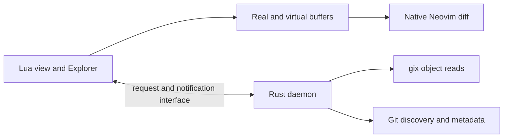

# Architecture and maintenance contracts

This is the maintainer reference for implementation boundaries and ownership. The [README](../README.md) introduces the plugin, the [user guide](user-guide.md) explains workflows, and [Neovim help](../doc/diffreel.txt) defines commands and APIs. Use the [development guide](development.md) to select checks when changing a contract.

## Purpose and boundaries

diffreel reviews a changing Git worktree while retaining normal buffer, LSP, and navigation behavior. Native diff performs line/character comparison, alignment, synchronized scrolling, and folds. Git remains responsible for status, ignore/attributes, and rename candidates. There is no staging, discard, merge-resolution, or history UI.

The Rust daemon runs repository work and filesystem monitoring outside Neovim's event loop. Lua owns the UI, buffer leases, presentation, daemon preparation, and JSON-RPC transport.

## Ownership and lifetimes

| State | Ownership and lifetime |
|---|---|
| UI manager | [manager.lua](../lua/diffreel/manager.lua) starts one manager per canonical worktree root from the registry that [init.lua](../lua/diffreel/init.lua) owns, queues views that arrive during startup, and closes the backend on cancellation; init.lua routes each backend notification to the views on that manager. Tabs in the same editor/worktree share a session. Closing a review retains a healthy manager; editor shutdown closes it. |
| Public API and view hub | [init.lua](../lua/diffreel/init.lua) exports the Lua API and keeps selection, comparison lifecycle, layout, navigation, open/close and setup together because they call each other; the leaf concerns below are required from it. |
| Explorer and winbar rendering | [render.lua](../lua/diffreel/render.lua) rewrites the explorer buffer, composes every owned pane's winbar, decides whether a view still animates, and derives the dirty/missing labels from buffer and disk state. |
| Buffer application | [buffers.lua](../lua/diffreel/buffers.lua) creates owned scratch buffers, fills virtual sides, replaces a pane's buffer under the buffer-operation counter, computes the content digest, and attaches the single line observer. |
| Lifecycle events | [events.lua](../lua/diffreel/events.lua) fires the `User Diffreel*` autocmds with view/comparison context and tracks Enter/Leave. |
| Repository | [repository.rs](../daemon/src/repository.rs) owns Git directories, HEAD, comparisons, discovery metadata, and metrics. Linked worktrees retain separate index/HEAD state. |
| Comparison | Resolved endpoints, sorted/deduplicated Git pathspecs, untracked inclusion and an optional pinned file identify a cached comparison through structured serialization. Entries, index snapshot, statistics cache, generation, dirty state, errors and reconciliation belong here. |
| View | Each review tab owns selection, transition counters, windows, and virtual buffers. Backend subscriptions carry visibility so hidden views need no periodic work. |
| Real working-tree buffer | Shared with ordinary windows and possibly other views. [lease.lua](../lua/diffreel/lease.lua) borrows mappings/options; diffreel does not own the user's text. |
| Window presentation | [presentation.lua](../lua/diffreel/presentation.lua) records original/installed options per view, window, and buffer, including hidden buffers' cached window settings. |

Argument-free `:Diffreel` closes a valid diffreel view in the current tab or opens HEAD → worktree. Explicit arguments/options and the Lua `open()` API create a view. A literal left `HEAD` with right `worktree` or `:0` (index) follows HEAD; other revision expressions resolve once. Merge-base comparisons freeze their resolved commit endpoints. `resolved_spec` carries fixed OIDs and scope options across restart and omits merge-base resolution, preventing a moved branch from changing the baseline. HEAD transitions open a new comparison without changing unrelated fixed views.

[options.lua](../lua/diffreel/options.lua) validates comparison settings and parses command flags before creating windows. Exclusions become explicit Git glob pathspecs; ordinary inspection paths keep literal semantics. The initial-file preference is captured from the invoking real buffer and consumed once, including by an explicit selection after delayed startup. It must never override a subsequent choice or displace a retained draft. [completion.lua](../lua/diffreel/completion.lua) performs asynchronous, time-bounded ref discovery with a bounded repository cache; completion never reaches daemon preparation. Command registration supplies the current review tab’s repository, independently of managed-pane mapping ownership. Initial window/buffer allocation is guarded before registering a view so a split failure can release its partial resources.

## Requests, notifications, and stale work

[backend/rust.lua](../lua/diffreel/backend/rust.lua) uses `vim.lsp.rpc.start` for JSON-RPC 2.0 over stdio with Content-Length framing. This reuses transport, not an LSP client attached to virtual files. [rpc.rs](../daemon/src/rpc.rs) handles framing, [main.rs](../daemon/src/main.rs) serializes repository work/events, and `Repository::handle` dispatches methods.

Keep daemon stdout exclusively for framed RPC; diagnostics go to stderr so they cannot corrupt message boundaries.

The client closes the backend when a request waits 120 seconds. Requests queue behind reconciliation on the repository loop, and one reconciliation runs several Git commands that may each take up to 30 seconds, so a shorter deadline would stop healthy large-repository views. Each loop iteration drains queued requests and filesystem events for up to about 50 ms before running at most one batch, so a backlog becomes one batch instead of one batch per queued event; a request normally waits for the reconciliation already in progress. Responses, PR job output and notifications raised by a request are written before the next queued request is handled.

Protocol 4 exchanges include `initialize`, `comparison/open`, `comparison/list`, `comparison/file`, `comparison/stats`, `blob/read`, `view/update`, `comparison/refresh`, and `comparison/close`. Snapshots carry comparison identity, generation, entries, and update/error state. Notifications include `comparison/updated`, `comparison/progress`, and `repo/changed`; transport failure reaches the UI as `backend/error`. Protocol 4 adds immediate-acknowledgement PR acquisition jobs, completion/error notifications, fixed-snapshot restoration, release and cache cleanup; incompatible custom binaries are rejected.

`comparison/file` accepts a comparison ID and literal relative path, returning endpoint metadata without changing comparison membership. Commit and index endpoints use the comparison's captured state; the worktree side is inspected currently. Retained drafts use it when their path leaves Git's change list. It reads ignored worktree files for disk-state comparison while normal discovery still excludes them. Its responses use the same selection, comparison, session, and view-lifetime guards as blob reads.

The UI routes notifications only to views using the originating manager and comparison. `receive()` rejects older generations. Selection callbacks check view validity, selection sequence, comparison ID, session, and navigation state. Opening a comparison uses a separate sequence. [lifetime.lua](../lua/diffreel/lifetime.lua) names that guard as a ticket: `ticket(view, scope)` captures the manager, its session and the sequences a result belongs to, and `current(view, ticket)` re-checks them with `valid(view)` where the result is applied. The `manager` scope compares the manager and session, `comparison` adds the comparison sequence, and `selection` adds the comparison ID and selection sequence without the comparison sequence, because a failed comparison open must not strand a selection that was already in flight. `ready`, `selection_pending`, `switching`, `navigation` and `closing` are written only through the named transitions in [phase.lua](../lua/diffreel/phase.lua), whose predicates (`settled`, `selected`, `has_content`, `interactive`) name the recurring combinations; `updating` and the snapshot-mirrored `error` also follow daemon state in `receive` and progress notifications, and a closed backend stays explicit at the call site. The layout flags and the PR request state are separate axes that overlap with those phases by design. Keep checks where results are applied: cancellation or a successful RPC response does not prove the target view is current.

Duplicate snapshots do not restart a ready or pending selection. Snapshot generation alone is insufficient for this check: a repeated failure can finish a new progress interval without changing generation or error text. Retry and navigation return can re-apply the latest snapshot. Repeated file navigation at an unchanged endpoint also avoids new content requests.

Worker failure keeps prior content visible with a stopped state. `R`/`:DiffreelRefresh` retries the affected view against a new manager when needed; other failed views are not silently moved. Closing invalidates the view before releasing subscriptions, mappings, and owned buffers. One cleanup error must not prevent later releases. Disposal releases every lease registered to the view, including an incoming buffer whose enter hook aborted before pane assignment.

References: [ui_races.lua](../tests/ui_races.lua), [ui_restart.lua](../tests/ui_restart.lua), [crash.lua](../tests/crash.lua), and stability `worker-crash`.

## GitHub PR acquisition

[pr.rs](../daemon/src/pr.rs) confines GitHub acquisition to existing local clones
and refs under `refs/diffreel/pr/`. `gh` resolves PR metadata and supplies credentials
through a per-process HTTPS helper. Exact recorded base/head SHAs establish the
comparison; current branch tips and merge results are not substitutes. Dedicated
staging refs are verified before publishing immutable snapshot refs containing
base, head and merge-base objects. Git ref transactions and no-deref checks
protect cache publication/deletion. Internal fetch disables bundle URI processing,
normal ref mapping, tags/pruning, submodules, hooks, auto-maintenance and FETCH_HEAD
writes. No persistent Git configuration is changed.

`pr/prepare` acknowledges a job ID immediately. The same daemon executable runs
`--pr-worker` as a separate supervisor process; GitHub/fetch waits do not occupy
the repository RPC loop or count against the client's request deadline. Results return as
`pr/prepared`/`pr/error` notifications with session, view, job and client-request
identities. The worker's own 120-second deadline and control-pipe EOF cancel its process
groups. Closing/superseding the view cancels obsolete work and suppresses stale
publication into the UI; successfully published cache refs remain reusable.

The common Git directory contains a shared/exclusive OS cache lock. The daemon
holds a shared lease before starting a job and while its PR view remains active.
The worker holds its own shared lease; mutating descendants inherit it so killing
the supervisor cannot permit concurrent ref deletion. Inherited holders close
descriptors rather than explicitly unlocking the shared open-file description.
Cache clear takes a nonblocking exclusive lock and removes snapshot/stale staging
refs only. It never runs GC. `pr/restore` reacquires protection, verifies/recreates
the exact snapshot refs, and registers the old comparison in a fresh daemon.
After all backing processes die, deliberate cleanup plus GC can make fixed
recovery unavailable; that is an explicit error.

[pr.lua](../lua/diffreel/pr.lua) owns the per-view request timer and candidate
comparison association. Both initial virtual sides are read before updating the
real association and activating PR metadata/snapshot together. Fetch, comparison
creation and initial blob failures leave the previous view intact. Explicit
selection cancels a candidate. A temporary association retains the old comparison
while transferring the real view to the candidate; cancellation queues restoration
of the old association before releasing either temporary association. Otherwise
the cache can evict the old comparison before the update response reaches Lua.
Closed views and replaced managers/sessions cannot
consume late callbacks. Recovery itself is a guarded transition. Existing Ready
and lifecycle events describe activated content, not acquisition acknowledgement.

Tests use deterministic gh responses and local remotes, plus recorded public
histories under [tests/fixtures/pr](../tests/fixtures/pr). `pr_live.ts` verifies real
fetches against those endpoint observations when explicitly run with GitHub access.

## Discovery, monitoring, and content

Full reconciliation combines Git raw-diff candidates and worktree status, then normalizes actual left/right content and metadata by path. Index-only differences do not remain content changes when compared endpoints match. Git pathspecs apply to raw discovery before rename normalization so a rename crossing a scope is projected as an addition or deletion. Renames remain renames only while the normalized source is deleted and destination added; source reappearance changes that interpretation. Fixed revision pairs resolve both sides from trees rather than worktree presence or ignore rules. Empty endpoints use Git's empty-tree OID in diff, avoiding `ls-tree`'s restrictions on pathspec magic.

Index comparisons capture stage-zero mode/OID pairs in a comparison-owned snapshot and read immutable blobs from those OIDs. Nonzero stages remain explicit conflicts. Porcelain v2 distinguishes intent-to-add from genuinely staged empty files; their stage-zero OIDs alone cannot. An unresolved path must also enter discovery when raw HEAD/worktree diff is empty: matching disk bytes do not resolve its index conflict. Scoped unmerged queries preserve this contract independently of untracked visibility. Shared status metadata is global or updated through literal paths, rather than replaced with one view's filtered status.

Partial updates are limited to unscoped commit/worktree comparisons and stable regular-file content changes. Index or scoped comparisons, missing/new paths, type changes, rename endpoints and uncertain membership expand to full reconciliation. Parse paths with NUL delimiters and validate separately from escaped/truncated Explorer text. Pattern interpretation is enabled only for intentional scope queries; content inspection, attributes and partial paths remain literal. A read error is not evidence of absence.

An intermediate path that has become a file makes its former descendants absent (`ENOTDIR`), just as a missing parent does. Other read errors remain errors. Both watcher classification and full reconciliation preserve this distinction. The explorer can display a path as a file while also listing descendants from the opposite endpoint.

Watchers start before initial discovery and observe the worktree, Git directory, and common Git directory. Events coalesce for 100 ms, with 250 ms as the maximum batching wait; this is not a Git-work or rendering latency bound. Changes during a job remain pending. Metadata/config changes, rescan/error signals, and overflow trigger broader reconciliation; once one is queued, later events do not delay it. Before a partial batch, `git check-ignore` drops untracked paths that Git ignores. It runs with `--no-index` because an index-backed query scans the whole index once per path, so paths present in HEAD, status, a comparison, or a HEAD submodule are excluded before the query. A failed query (for example, a path beyond a symlink) keeps every path. A batch left empty clears staleness without Git reconciliation.

`Comparison::mutable()` includes worktree endpoints, either index endpoint, and attribute pathspecs. These visible comparisons reconcile every 30 seconds by default. Hidden comparisons retain stale state and reconcile on redisplay as needed; a view update for an already-visible comparison does not start reconciliation, since its pending batch and the timer cover it; index comparisons also reconcile on reopen/redisplay with watching disabled. Fixed commit content stays fixed, but attribute pathspec membership depends on current worktree attributes and is re-evaluated. Manual refresh reconciles mutable views. Focus return reconciles them only when monitoring is disabled, or restarts a stopped backend; with monitoring enabled it would make the next selection wait for Git. A missed event can take 30 seconds plus processing to recover. This is eventual reconciliation, not an atomic filesystem snapshot.

Pinned file comparisons include a validated literal file in their comparison
identity. They bypass change-list membership, configured scopes and ignore
filtering, preserving an unchanged or both-missing entry for explicit review.
They still apply content/attribute limits and captured index/commit semantics.
Pinned worktree refresh uses full reconciliation, and saved statistics use the
same include-ignored policy. The client retains the file in resolved restart
specifications; missing saved endpoints can still display a matching dirty
real buffer. Paths are normalized against the repository before creating a view,
without following the final file's symlink target.

### Saved line statistics

Statistics are opt-in. [stats.rs](../daemon/src/stats.rs) counts saved endpoint lines with [imara-diff](https://docs.rs/imara-diff/0.2.0/imara_diff/)'s Myers implementation. Reconstructed bytes retain BOM, line endings and EOF newline; missing and zero-byte sides have zero lines despite Neovim's placeholder buffer line. Counts belong to normalized endpoint pairs, including rename source OIDs and untracked additions, rather than raw Git status rows.

`comparison/stats` requires a comparison ID and current generation, and accepts an offset. Responses include session/comparison/generation, a file-count map, `next_offset` and `complete`. Each request handles at most 32 files, stops before another file after 16 ms or a 4 MiB input budget, and yields through the client between pages. A single file's computation is not preemptible; pairs over 4 MiB or 200,000 lines report `stats-too-large`. Content limits still apply. No Git process is spawned per file.

Commit/index counts use captured OIDs. Worktree reads must match the snapshot's existence, kind, mode and digest or return `stale`. Unsupported or failed reads remain unavailable, not zero. Per-file results cache within one generation; refresh invalidates them. [line_stats.lua](../lua/diffreel/line_stats.lua) starts after `DiffreelReady`, guards callbacks with manager/session/comparison/generation/transition/state/view ownership, coalesces renders and leaves errors separate from content readiness. Selection does not invalidate comparison-wide counts. Statistics never read draft text or affect prepared diff buffers.

[content.lua](../lua/diffreel/content.lua) and [model.rs](../daemon/src/model.rs) distinguish missing/empty files, UTF-8/BOM, line endings, EOF newline, modes, and content identity. Symlinks compare target text without following links. Binary, large, transformed, conflicted, sparse, and submodule entries report limitations rather than vanishing or appearing as empty ordinary text.

References: [content_cases.lua](../tests/content_cases.lua), [repository_modes.lua](../tests/repository_modes.lua), [watcher.lua](../tests/watcher.lua), [regressions.lua](../tests/regressions.lua), and stability `multiple-comparisons`, `rename-reappear`, `ignore-change`, and `mixed-updates`.

## Buffer safety, rendering, and interaction

The left revision is virtual. Supported working-tree files use real right buffers; fixed revisions, absent sides, and limited content use virtual buffers. A matching modified real buffer takes precedence even if its disk file disappears or becomes unsupported. Buffer loading can invoke editor hooks before the incoming buffer becomes the selected pane. Removed load buffers are checked before reading options, and failed loads release their incoming lease so selection can be retried. External content must not overwrite drafts. Buffer-derived state updates on edits, writes, and reconciliation even when the entry list is unchanged.

The left pane reuses one virtual buffer, so its window keeps the previous file's view, while a replaced right buffer restores its own window position; native diff does not resynchronize them until a pane scrolls. Applying a different selected path therefore resets every diff window (including the inline engine) to the first line and discards the saved split-layout left view. Reapplying the same path, including HEAD, PR and comparison transitions, keeps the position; clearing the selection forgets the positioned path.

The selected modified buffer remains an explorer entry when its path leaves a snapshot, including while definition navigation pauses the panes. Its old entry cannot supply endpoint metadata after a HEAD transition, disk reversion, or ignore change; selection inspects the path against the current comparison before publishing the retained draft.

Real buffers have at most one diffreel line observer ([buffers.lua](../lua/diffreel/buffers.lua)), reused across views and leases. It detects API edits even when the buffer is not current, and detaches on unload or the next edit after the final lease ends. Buffer-state work is coalesced with normal editing events; format-option changes use the affected buffer at `OptionSet` time. The shared lease caches its digest by changedtick, fileformat, BOM and EOF-newline state and releases the cache with its mappings/options.

Before replacing a pane buffer, `set_review_buffer()` in [buffers.lua](../lua/diffreel/buffers.lua) disables native diff on the old participant and restores its owned presentation. Neovim can retain hidden buffers in the tab's diff comparison after a window switches buffers, coloring unchanged lines and corrupting alignment. Validate actual content and unchanged-line highlighting, not just two `diff=true` window options.

Virtual names stay stable for the view; `b:diffreel_root` and `b:diffreel_path` carry selection metadata. Repeated renaming creates alternate-name buffers even with `keepalt`; repeated open/close must not accumulate them. Stop Tree-sitter state when changing languages so plain text does not inherit an old highlighter.

Keymap defaults, native key validation, and named operations live in [keymaps.lua](../lua/diffreel/keymaps.lua). Configuration is resolved before setup mutates active state; effective changes are rejected while any view remains. The validated policy is shared across all live views, avoiding conflicting bindings on shared real buffers. `show_help` compares installed native mappings with owned callbacks/lease dispatchers, so overridden or disabled bindings are absent. [popup.lua](../lua/diffreel/popup.lua) owns help and path popups separately from review panes, cleans partially created resources on failure, and preserves the review on popup close.

Real-buffer mappings dispatch only when the current review owns the buffer lease and displays that buffer in its right pane. This predicate is checked again at action execution, so a definition target leased by another review retains its ordinary behavior. Non-expr Plug actions preserve counts and input order; scheduling a pane change lets typeahead run in the old window. Fallback mappings preserve ordinary-window behavior. Restore only values still equal to those diffreel installed, preserving later user changes.

Original local mappings are captured before any installation, including fallback through native alternate keys. Ordinary-window dispatch resolves global mappings at use time so later additions, replacements and removals remain effective. Internal aliases are allocated without replacing existing names. Recursive mappings retain Neovim's literal leading-LHS behavior, including expressions and native alternates whose effective fallback still belongs to the same mapping. Script-only mappings retain their remapping scope. Restoration removes owned dispatchers before restoring originals and protects later replacements from alternate-key side effects. Fallback expression mappings preserve their original keycode-expansion flag. A mapping restoration failure does not skip other mappings, aliases or buffer options. Tab-scoped Close/Refresh commands also work from an extra split without treating that split as a review pane for buffer mappings.

Definition navigation can replace the right window's displayed buffer. During navigation diffreel removes diff/presentation effects and avoids switching the user back on updates. Returning to the source resumes comparison. Native pane closure, movement, or replacement invalidates broken review layouts; moved copies must not retain review styling in ordinary tabs. Close requests made during buffer or layout transitions wait until those operations finish. Active temporary autocmd windows are checked across all windows: a nested wait can change focus while a loading window remains on the native call stack. The closing flag rejects obsolete selection results during that interval.

Restoring hidden real buffers' cached options may need a temporary hidden window. Cleanup first allocates a safe buffer/window, retains its ID, suppresses reentrant window/buffer/option events temporarily, and restores state even after an error. The temporary FileChangedShell guard covers only diffreel's operations on modified buffers; a persistent guard would suppress unrelated editing warnings.

| Contract | Regression reference |
|---|---|
| Drafts survive external deletion/replacement and close | `dirty-delete`, `dirty-binary`, `dirty-delete-close` in [stability.ts](../tests/stability.ts) |
| Save/content matching clears stale labels | `save-undo`, `dirty-matches-disk`, `buffer-matches-disk` in stability |
| Drafts remain current outside the Git change list | `dirty-head`, `dirty-baseline`, `dirty-ignored`, `navigation-head` in stability; delayed inspection cases in [ui_races.lua](../tests/ui_races.lua) |
| Only intended buffers participate in diff | [diff_display.lua](../tests/diff_display.lua), [probe.lua](../tests/probe.lua) |
| Ownership and exception-safe cleanup | [presentation.lua](../tests/presentation.lua), [cleanup_errors.lua](../tests/cleanup_errors.lua) |
| Counts, ordered input, tab toggle, no virtual-buffer leaks | `rapid-selection`, `toggle`, `rapid-open-close` in stability |
| LSP attachment and definition/return | [e2e.ts](../tests/e2e.ts), [lsp_server.ts](../tests/lsp_server.ts) |

## Hunk navigation and lifecycle hooks

[h/]h use native diff motions and carry a per-view pending operation through
exact selection readiness. Manager/session, comparison, path, selection sequence
and tab ownership are rechecked before landing. Explicit selection, departure,
restart and disposal cancel pending work. Metadata/unsupported files are skipped;
navigation stops at the comparison boundary. [H/]H query the native endpoints.
Both pane views are restored after query motions because native binding can move
the peer. A separate saved-content diff would disagree with drafts and diffopt.

[hunks.lua](../lua/diffreel/hunks.lua) uses native motion boundaries plus
`diff_hlID()` to select nonempty real lines, preserving linematch subhunks.
Missing placeholders and filler-only anchors have no text object. Counted
objects include successive nonempty hunks in a contiguous same-file range.
Operator mappings reject ineligible ranges at expression dispatch, before an
operator can clear registers or enter Insert mode. Non-expression actions force
linewise Visual selection even with `selectmode=cmd`. x/o leases reuse Normal
mode's fallback/restoration rules, with separate maps and explicit mode arguments
to `mapset`; Select mappings remain outside the lease.

Lifecycle User events carry scalar view/comparison context rather than a view
table. Open precedes backend startup. Each successful preparation announces both
DiffBufRead sides, changed FileSelect identity, then Ready when reconciliation
has finished. Callbacks may close/select; guards apply after each hook. Enter/
Leave follow tabs, LayoutChanged follows effective API layout changes, and Close
follows disposal exactly once. A native window callback error cannot bypass
cleanup. Shutdown rejects reentrant opens until all owned resources are released.
`get_view(id)` resolves only still-active handles. See
[events.lua](../tests/events.lua), [events_edges.lua](../tests/events_edges.lua),
[hunks_ui.lua](../tests/hunks_ui.lua), and [navigation_edges.lua](../tests/navigation_edges.lua).

## Diff layouts and inline projection

[windows.lua](../lua/diffreel/windows.lua) distinguishes visible panes, native
diff engines, all owned windows and a visible explorer from the view record
alone, so presentation, hunk queries, layout and lifetime checks can share those
roles without requiring each other.
[layout.lua](../lua/diffreel/layout.lua) owns split ratios, staging engines and
the transitions between layouts. Side-by-side and stacked use two visible
native diff windows. Inline retains the visible real right buffer with
`diff=false`, converts the left pane to a hidden float, and adds a hidden right
engine on the same buffer. Window validation, hunk queries, buffer replacement,
navigation and disposal use these roles. Remove the previous engine buffer from
native diff before replacing it; hidden participants still affect comparison.

Live inline entry precomputes in temporary hidden engines. Only a current,
validated result commits the geometry change. Buffer application is deferred
while geometry changes; selection and PR acquisition keep their own guards.
Accepted layout switches cancel pending cross-file hunk navigation. Split
ratios and right context-fold state survive switching. Risky geometry changes
retain the old engine until commit so rollback cannot restore a closed ID.
Native diff-owned presentation values are captured before `diffthis`; capturing
afterward would cache its temporary options as ordinary-buffer originals.
`diffoff` writes are also tracked so native manual-fold restoration does not
overwrite the original folding setting or later user changes. Before native
closure, all managed panes are restored while their options remain readable;
ownership records survive until disposal can clean copies created by CTRL-W T.

[inline.lua](../lua/diffreel/inline.lua) uses runtime-checked experimental
`nvim__ns_set`/`nvim__ns_get` namespaces scoped to the visible right window.
Deleted text is virtual; the real buffer, Undo and LSP attachment are untouched.
The cache key includes endpoint buffers and changedticks, comparison and
selection identity, diff options, viewport width and horizontal offset.
Stale/cancelled results cannot attach. WinClosed invalidates inline decorations
synchronously; scheduled disposal releases buffers, engines and leases. Only a
fully cleared namespace can return to the pool.

Coarse `vim.text.diff` indices omit Lua linematch. They nominate candidate
ranges, while hidden native engines decide changed rows, character highlights,
hunk stops and context folds. Each coarse range is primed on both sides by
positioning a fold-disabled, unwrapped, unbound engine and querying `line("w$")`
and `diff_hlID`. The final native scan must not find changed rows outside the
candidate coverage. Ignored blank/whitespace rows are filtered by native diff;
removed rows retain old-file order at each coarse block's start, without
claiming refined linematch interleaving. Native folds are measured separately
with folding enabled, then cached for the visible fold expression. Extmark
anchors retain opened folds across edits. Character scans cover the horizontal
viewport and rebuild on horizontal scrolling. Deleted chunks expand tabs using
the old buffer’s display widths before adding the gutter, which would otherwise
shift their tab stops. Gutter and tab-setting changes invalidate the projection.
`diffanchors` checks use the buffer-local value with its global fallback.

Inline caps each side at 1 MiB and 20,000 lines, including drafts. Lua scan work
yields at roughly 8 ms checkpoints; synchronous native diff work is not covered
by that budget. Unsupported options, size or coverage cause split fallback
without truncation. Readiness waits for the current inline cache; buffer events
identify visibility and omit the hidden left window ID. No layout operation
requests new Git content or changes the daemon protocol.

## Highlight definitions and ownership

[ui.lua](../lua/diffreel/ui.lua) resolves the shared UI symbol defaults and formats endpoint labels, winbar literals and wrapped descriptions. Setup validates and merges `ui_icons` before publishing configuration; each new view copies the result. Headers, folder rows and popup titles use that view's snapshot, so later setup calls do not reclaim presentation options from paused panes or recreate open popups. Git status and file-type icons retain their separate configuration paths.

The explorer retains its three header rows and stores footer fragments by semantic message ID and source-text byte offset. Reflow restores a footer cursor to the same message and clamps its offset if the text shrinks; a removed message leaves the cursor within the new footer. Progress messages are not footer fragments; they live in the top-right winbar. Directory rendering caches the resolved open/closed symbols by value. Display widths govern wrapping and alignment, while highlight and cursor positions use byte offsets.

[highlights.lua](../lua/diffreel/highlights.lua) owns the public group registry and theme-derived defaults. Setup prepares fresh effective definitions, invokes `on_highlight`, and validates the complete result in a separate namespace before publishing it. Explicit callback edits override external definitions; untouched entries retain them. Installed definitions and displaced external values are tracked so callback replacement or removal restores only values still owned by diffreel. ColorScheme rebuilds defaults and drops cleared/replaced external values; callback failures notify and apply the theme/default layer.

Explorer rows cache byte ranges and group names, not resolved colors. A successful highlight application changes the generation and rerenders live explorers; hidden panels pick up the generation on reveal. File icon routing follows explicit definitions through the registered link chain, otherwise retaining provider colors. Direct icon changes require setup to invalidate existing provider extmarks. Popup buffers use dedicated groups and local window mappings. Native diff uses the existing presentation ownership and cleanup path; new chrome remaps preserve preexisting user aliases.

Default diff backgrounds blend theme colors with `Normal`; panel and header surfaces derive from its foreground/background when both are present. Transparent themes retain the native chrome links. The selected-row marker overlays a reserved leading space, leaving file labels and cached byte ranges intact. Blank end-of-buffer characters use the presentation lease and preserve the raw `fillchars` value, including literal commas that `vim.opt` cannot round-trip. Native diff filler characters retain the user's setting and use `DiffreelFiller` for subdued alignment rows.

## Explorer hierarchy and cursor

[explorer.lua](../lua/diffreel/explorer.lua) builds the full comparison hierarchy from current entries, including retained drafts and hidden descendants. A node's branch capability is independent of entry presence: a file entry can have descendants from the opposite endpoint. Rendering keeps its file status/selection and adds branch disclosure. Paths are split by components rather than tested as raw prefixes.

[panel.lua](../lua/diffreel/panel.lua) owns the optional explorer split. The two
diff engine and visible pane windows always participate in layout validation; hiding a panel cannot
skip those checks. Moving the panel reconfigures the existing native split,
removes accidental diff membership, and keeps the pane buffers. Rollback leaves
the comparison available after a native layout failure. [popup.lua](../lua/diffreel/popup.lua)
owns help and full-path floats, including partial-allocation cleanup.

Review headers are stored per window as a left part and an optional right part. Each write recomposes every stored header and appends the review-wide label (progress, pause or retry) after the right part of the non-floating pane that sits highest and then furthest right, so the label follows layout and explorer placement without a window of its own. A stored header whose window now carries a different winbar is dropped rather than rewritten; the next explicit header write reclaims it, which is how a pane restored during navigation returns. The label is omitted while the review is not ready, because the pane's `Loading` header already carries a spinner.

[full_name.lua](../lua/diffreel/full_name.lua) owns the nonfocusable cursor-row
overlay. Explorer rows retain both shortened and full text with matching byte
ranges; both surfaces share icon and selection highlighting. Updates coalesce
after cursor restoration and recheck the focused view, row and screen geometry.
The overlay accounts for the winbar, viewport and text offset, keeps its origin
fixed, and caps its width at the screen edge. Horizontal scrolling and wrapping
suppress it. Unchanged content and geometry reuse the window; closing the
overlay retains its scratch buffer until view disposal. Its windows stay out
of layout ownership, native diff and lifecycle checks triggered by their own
closure. Disposal continues through the existing protected cleanup sequence.

Explorer dimensions retain their configured number/function separately from
saved native sizes and the last applied editor-resize generation for each axis.
Panel preparation evaluates only the active dimension before layout mutation;
initial preparation precedes tab allocation. `VimResized` increments a generation
and schedules a coalesced update for the visible current review. Inactive tabs
and hidden panels consume the latest generation when entered or shown. A
generation change expires dynamic/manual sizes even after a screen-size round
trip. Numeric dimensions keep native/manual resizing. Callback results are
checked against the view lifetime and explorer update sequence before applying.
Automatic failures leave the review usable, record the failed generation to
avoid retrying on repeated tab entry, and suppress repeated notifications per
axis until recovery. Automatic sizing does not emit `DiffreelLayoutChanged`.
The layout module tracks preferred split proportions separately from its last
applied geometry. Ordinary `WinResized` observations capture manual changes;
`VimResized` marks every review pending before scheduling adjustments, preventing
native editor resizing from overwriting the preferred proportions. After the
explorer adjustment, including a failed or skipped size calculation, the active
review restores its split proportion. Inactive reviews defer restoration until
tab entry. Applied geometry is recorded without treating rounded or constrained
sizes as new preferences, so repeated resizing retains the original proportion.

Each view owns its fold map and hierarchy. A new snapshot or replaced retained-entry metadata rebuilds that hierarchy; selection, folding and buffer-state updates reuse it. This also applies during definition navigation. Row generation drops fold state for vanished branches and leaves new branches expanded. Tree actions change only folds and explorer cursor; they do not call the backend or replace diff buffers.

Flat mode derives a sorted file-only order; compact mode projects single-child
chains onto deepest-directory rows without replacing the logical hierarchy.
Aliases and visible-parent paths keep cursor, fold and copy operations coherent.
The hierarchy retains one row layout keyed by mode, compaction, width, fold state, icon provider, the optional saved-statistics map and Neovim display-width policy. Statistics pages replace that map rather than mutating the cached reference. Visible file icon/group results are rechecked because a provider can change its output without replacing the module. Display-width inputs include cell-width overrides, printability, Arabic shaping and current-window tab/list settings. Replacing the hierarchy also invalidates its rows, keeping retained-entry status and metadata current.

The explorer buffer is rewritten and decorated when its rows, selection, text or changedtick differ from the last render. Cursor restoration still runs when that work is skipped. Footer state is recomputed each time, so updates to the unsaved-buffer message and the selected file's details remain visible; progress, pause and retry labels are recomposed into the headers in the same pass. While a review waits, the loading symbol is supplied frame by frame from one shared timer in [spinner.lua](../lua/diffreel/spinner.lua), so every waiting label in every review shows the same frame. Frame advances reuse this same render in a mode that updates the headers and returns once the footer rows are recorded, before cursor restoration, rather than writing buffer text through a second path; only reviews in the current tabpage are redrawn, and the timer stays alive for waiting reviews elsewhere so their symbol is not frozen on return.

The explorer cursor is independent of the selected comparison file. Rendering preserves the cursor column and viewport for an unchanged visible row, and resolves a hidden or removed target to a visible ancestor, then the first row. Header/footer positions are preserved across automatic renders. The ordered hierarchy supplies both displayed rows and file-navigation order, including hidden files. Automatic snapshot selection preserves folding, while explicit selection reveals ancestors. The no-read file-navigation boundary path also reveals the selected file, preserving the existing error/navigation retry conditions. WinResized redraws the explorer and refreshes an active inline projection; it does not request repository data.

Path copies use original row paths/names and Neovim's characterwise clipboard register. They neither resolve symlinks nor require disk existence. Provider command failures can return a successful setreg() status, so native diagnostics must not be contradicted by a success notification.

References: `tree_actions.lua`, `tree_clipboard.lua`, `tree_clipboard_command.lua`, and `tree_ui.lua` under [tests](../tests).

## Measurement contract

`User DiffreelReady` announces prepared content and comparison/selection identity before the eventual UI flush. [benchmarks/probe.lua](../benchmarks/probe.lua) checks full left/right hashes, expected entries, pane membership/options, and the fixture's unchanged-line highlighting. [tests/support.ts](../tests/support.ts) observes the subsequent UI flush. Both correctness and that endpoint are needed for an open/switch timing claim.

Measurements separate minimal/normal configuration, cold editor/backend starts, warm opens/switches, and live updates. Cold does not mean cleared OS caches. Warm request Git spawns and background reconciliation are separate. [metrics.ts](../benchmarks/metrics.ts) accounts for process-family CPU including reaped children; sampled RSS/footprint maxima are observed, not absolute peaks.

Keep source unchanged during measurement and retain hashes, sample counts, build provenance, and commands. Small execution checks validate the harness, not performance adoption decisions. See the [maintenance guide](maintenance.md#performance-measurement) for benchmark setup, commands, and reporting requirements.

## Daemon distribution and startup

[distribution.lua](../lua/diffreel/distribution.lua) hashes sorted relative build-input paths and each file's raw SHA256 with length framing. Rust source, Cargo inputs, build metadata, fixed distribution settings, build/validation scripts, the pinned Deno version, and identity code participate. The standalone validator does not import the test tools, so their Deno configuration and dependency lockfile do not participate. UI, documentation, tests and generated files do not. CI and the installed plugin use this same implementation without consulting Git history. The desired ID is retained for the editor session once selected; updates require a fresh editor.

[install.lua](../lua/diffreel/install.lua) chooses an explicit daemon, a global daemon path, or the exact managed cache. Explicit binaries bypass source hashing and need a compatible protocol. Managed binaries require matching build ID, target and protocol, plus manifest size and SHA256. `--build-info` works without a repository; `initialize` returns the same metadata. Cargo/Nix builds without `DIFFREEL_BUILD_ID` identify as `local`.

Downloads coalesce per editor. Each attempt owns its subprocess, timeout and unique staging directory. Publication atomically replaces the executable, then its verification record as the commit marker. Concurrent editors fetch the same immutable release; they never delete each other's staging. A missing or mismatched pair is a cache miss. New editors verify the digest before execution; the result is memoized only while file and record identities remain unchanged. No automatic cache collection runs.

Pending managers have an owner and waiters before transport construction. Every preparation/initialization callback checks manager ownership, and each waiter checks view lifetime and startup sequence. Closing the last provisional view cancels startup; an already running download may complete the cache but cannot spawn a daemon or reopen that view. Shutdown cancels owned installation processes and staging. Healthy managers survive the last view closing.

The [CI workflow](../.github/workflows/ci.yaml) validates native binaries on four platforms; the [maintenance guide](maintenance.md#release-workflow) lists targets and release checks. macOS deployment starts at 14.0, with only Apple system libraries and an ad-hoc signature. Linux uses static musl. Release builds run outside Nix. Publication is restricted to trusted main runs and serialized by build ID. All four assets and their manifest are verified in a draft before becoming a complete prerelease; a complete cohort is never overwritten. Every published cohort the workflow reads must be immutable and carry a GitHub-signed release attestation matching the manifest digests. Subsequent UI-only commits reuse it.

Plugin source and daemon assets are public. The installer downloads exact release assets over anonymous HTTPS with `curl`; HTTP failures remain errors and never invoke an authentication tool. CI tests lazy.nvim and `vim.pack` at the tested commit SHA, with gh and build tools removed from the consumer PATH, no tokens, isolated HOME/XDG directories, and system/global Git configuration disabled. These post-publication tests verify actual GitHub delivery; local HTTP fixtures cover transport and lifecycle behavior.

Plugin versions are separate `vX.Y.Z` tags managed by release-please. Its PR job only prepares version and changelog changes; its publication job follows all native checks, daemon publication and consumer checks. [plugin-release.ts](../scripts/plugin-release.ts) requires exactly one merged PR carrying `autorelease: pending` and matches its merge SHA to the workflow's tested SHA before allowing publication. An unrelated successful main run cannot publish a pending version. Both release-please jobs share a concurrency group. Version files and release settings do not participate in daemon identity, and Cargo's internal package version is not synchronized with plugin versions.
