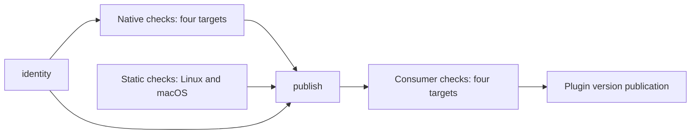

# Maintenance

For ordinary code changes, use the [development guide](development.md). This document covers binary distribution and measurement. [Architecture](architecture.md#daemon-distribution-and-startup) explains installation ownership and integrity.

## Distribution identity and validation

[daemon/rust-toolchain.toml](../daemon/rust-toolchain.toml) pins Rust 1.97.1. [distribution.json](../distribution.json) defines supported distribution targets and protocol settings. [distribution.lua](../lua/diffreel/distribution.lua) is the build-ID implementation used by both CI and installed plugins.

The ID includes Rust sources, Cargo inputs, build metadata, distribution settings, build/validation scripts, the pinned Deno version, and identity code. UI, documentation, tests, and generated files do not participate. Changing the native build recipe or accepted dynamic dependencies must change a hashed input. Do not add timestamps or commit SHAs to the ID.

The binary validator runs with `deno run --no-config -A` and uses no imported
dependencies. The test tools' `deno.json` and `deno.lock` therefore do not affect
daemon identity. A validator or Deno-version change produces a new ID; older
releases remain available to pinned plugin versions.

```sh
nvim --headless -u NONE -i NONE -l scripts/build-id.lua
nvim --headless -u NONE -i NONE -l tests/distribution.lua
nvim --headless -u NONE -i NONE -l tests/installer.lua
nvim --headless -u NONE -i NONE -l tests/startup.lua
nvim --headless -u NONE -i NONE -l tests/health.lua
```

The real HTTP/concurrent-editor fixture needs a daemon built with the current ID. From the repository root inside `nix develop`:

```sh
diffreel_build_id=$(nvim --headless -u NONE -i NONE -l scripts/build-id.lua)
DIFFREEL_BUILD_ID="$diffreel_build_id" cargo build --locked --manifest-path daemon/Cargo.toml
deno run --frozen -A tests/install_integration.ts --daemon daemon/target/debug/diffreel-daemon
```

Outside Nix, select the pinned rustup compiler with `cargo +1.97.1 build` instead. This local test binary can use development-toolchain libraries; it is not a release artifact. The fixture exercises concurrent installs, verified cache use, corruption/retry, close and exit during fetch, fresh installation/update hooks, and rollback. Unit-level installer tests cover malformed artifacts, HTTP failures and missing curl, timeout, and stale callbacks.

## Release workflow

Plugin versions and daemon binaries have separate release lifecycles. The plugin uses `vX.Y.Z` tags; daemon downloads continue to use immutable `daemon-<build ID>` prereleases.

The [CI workflow](../.github/workflows/ci.yml) validates four native targets:

| Target | Runner | Binary requirement |
|---|---|---|
| aarch64-apple-darwin | macos-14 | macOS 14 minimum, Apple system libraries, ad-hoc signature |
| x86_64-apple-darwin | macos-15-intel | macOS 14 minimum, Apple system libraries, ad-hoc signature |
| aarch64-unknown-linux-musl | ubuntu-24.04-arm | Static ELF for arm64 |
| x86_64-unknown-linux-musl | ubuntu-24.04 | Static ELF for x86_64 |

CI runs `just check` in the pinned Nix `ci` shell on Linux x86_64 and Apple Silicon alongside the native jobs. Native CI uses Neovim 0.12.5 and Git 2.55.0, reads the Rust version from `distribution.json`, builds an absent ID or reuses a validated complete release, executes the binary, and runs Rust and Neovim tests. Release builds run outside Nix; macOS artifacts must not link Nix-store or Homebrew libraries.



Native jobs expose separate binary-validation, Rust-test, Lua/Deno-test, and installation-test steps. The Lua/Deno runner uses `--jobs 2`, with exclusive suites described in the [development guide](development.md#suite-coverage). New commits cancel superseded runs of the same PR. Main pushes and manual runs have distinct workflow concurrency groups; the existing per-build-ID publication lock still serializes releases.

Rust dependency caches cover `daemon/target` and Cargo dependencies, excluding workspace crates and installed Cargo commands. The selected Rust toolchain, Cargo manifests/lockfiles, target, runner image, and native build script participate in cache selection. Toolchain selection occurs before restore. Deno's native and consumer jobs cache dependencies by job, OS/architecture, and a hash of `.deno-version`, `deno.json`, and `deno.lock`. A cache hit never skips a test or binary validation. The Nix static-check shell retains its own store cache.

Only trusted main pushes and manual main workflow runs can publish. Publication is serialized per ID. All four executables and `manifest.json` are uploaded and verified while the release is a draft, then published as an exact-ID prerelease. Completed releases remain immutable; UI-only changes reuse them. Old release IDs remain available for pinned plugins and rollback.

Post-publication [consumer tests](../tests/consumer.ts) install through lazy.nvim and `vim.pack` at the workflow's tested commit SHA. A Deno parent drives Neovim with an isolated runtime-only PATH that excludes gh, Deno, Python, Cargo, rustc, and Nix. The tests cover anonymous downloads, cache reuse, review updates, draft preservation, and close. The editor receives an allowlisted environment with isolated HOME/XDG directories, no authentication tokens, and system/global Git configuration disabled. These tests do not prepend the development checkout to runtimepath.

For workflow changes, run the available static checks:

```sh
actionlint .github/workflows/ci.yml
zizmor --offline .github/workflows/ci.yml
ravelact build --root . --no-cache
ravelact permissions --root . --no-cache
ravelact secrets --root . --no-cache
ravelact wiring --root . --no-cache
```

For timing comparisons, retain the run URL, source and executable identities, job/step durations, queue time, and cache-hit status. Compare equivalent changes with the same tool versions and test coverage, separating cold-cache and warm-cache runs. Use several runs before interpreting differences, and distinguish local suite timings from GitHub runner timings. Keep raw evidence under `.wadackel/qa/`; do not put historical pass counts or speed claims in the workflow instructions.

The [2026-09-15 CI measurements](measurements/ci-2026-09-15.md) record the initial cache misses and three cache-hit reruns of the same commit, including per-target timings and comparison limits.

### Plugin versions

[release-please-config.json](../release-please-config.json) configures one root package using the `simple` strategy. The action uses manifest mode: do not set its `release-type` input, which bypasses the configuration file. [The version manifest](../.release-please-manifest.json) starts empty so `initial-version: 0.1.0` controls the first release. Existing Conventional Commits contribute to its changelog. `version.txt` must exist for the simple strategy to update it. After bootstrap, release-please updates the manifest, version file and changelog in each release PR. Cargo's package version remains independent.

The workflow pins release-please-action v5.0.0 by commit. During 0.x development, breaking changes increase minor; features and fixes increase patch. Plugin GitHub Releases are ordinary releases, including 0.x, while daemon releases remain prereleases.

#### Setup and release

1. In repository **Settings → Actions → General → Workflow permissions**, enable **Allow GitHub Actions to create and approve pull requests**. Keep the default workflow permissions read-only; only the release jobs request write access. No additional Secret or PAT is needed.
2. Merge the versioning configuration into main. The `release-pr` job creates or updates a release PR without publishing a tag. Review its version and changelog; the first should be `0.1.0`.
3. Dispatch CI for the release PR branch using the commands below. The built-in `GITHUB_TOKEN` does not automatically trigger CI on the bot's PR changes. Verify the completed run's `headSha` equals the PR's current `headRefOid`; dispatch again if the PR changes.
4. After the static and native checks succeed, squash-merge the release PR, retaining its generated title and release metadata. The resulting main run publishes or reuses the daemon, runs all four consumer jobs, and only then publishes the plugin version at that merge commit.
5. Confirm the tag points to the release PR's merge SHA and both documented plugin-manager selections install it. Before the first tag exists, use the documented main settings.

```sh
gh pr view <release-pr-number> --json headRefName,headRefOid
gh workflow run ci.yml --ref <release-pr-branch>
gh run list --workflow ci.yml --branch <release-pr-branch> --event workflow_dispatch
gh run watch <run-id> --exit-status
gh run view <run-id> --json headSha,conclusion
```

PR-branch dispatches run checks without publishing daemon or plugin releases. On main, [plugin-release.ts](../scripts/plugin-release.ts) paginates closed PRs to find merged main PRs labeled `autorelease: pending`. Publication requires exactly one candidate matching the tested SHA. No candidate is a no-op; a different SHA is skipped with a recovery message. Multiple candidates or an API error fail the job without publishing. release-please leaves a merged pending release in place until it is published, instead of opening a new release PR.

#### Recovery and validation

For a transient failure, re-run the original merge-commit workflow with `gh run rerun <run-id>`, then watch it to completion. Dispatching main after it has advanced does not validate the older release commit. If the source itself fails validation, fix main and abandon the failed release candidate by removing its `autorelease: pending` label before preparing a replacement release PR; do not publish the failed commit or move an existing tag. A replacement may skip an unreleased version number.

The two release-please jobs share a concurrency group with cancellation of running jobs disabled. GitHub can still replace a pending job when another is queued; re-run the original merge-commit workflow if its publication job was canceled. A published version is never overwritten. If release creation succeeded but a comment or label update failed, a retry may repair the labels and still report a duplicate-release error; inspect the existing tag/Release, then re-run as needed until no pending candidate remains.

Run these focused checks for versioning changes, in addition to the workflow checks above:

```sh
deno task check
deno test --frozen -A tests/plugin_release_test.ts tests/release_test.ts
nvim --headless -u NONE -i NONE -l tests/distribution.lua
```

When changing release-please or the version policy, exercise the pinned release-please version against fixtures without GitHub writes: initial `0.1.0`, feature/fix `0.1.1`, and breaking change `0.2.0`. Use isolated Git repositories and fresh Neovim sessions to check lazy.nvim and vim.pack select SemVer tags rather than newer main commits or daemon tags, and support a fixed tag and rollback. Keep evidence under `.wadackel/qa/`. Actual anonymous delivery remains the responsibility of the four consumer jobs; local fixtures do not establish public availability.

## Public availability

Source installation and cold daemon downloads must work without GitHub authentication. The post-publication consumer jobs verify both package managers on all four supported targets at the tested commit SHA. They check the loaded plugin path, installed commit, build ID, and review behavior.

To repeat this check locally after publication:

```sh
DIFFREEL_COMMIT="$(git rev-parse HEAD)" \
DIFFREEL_EXPECTED_ID="$(nvim --headless -u NONE -i NONE -l scripts/build-id.lua)" \
deno run --frozen -A tests/consumer.ts
```

Local HTTP fixtures verify transport and lifecycle behavior; the consumer jobs verify actual GitHub delivery. Maintainer release operations use GitHub CLI authentication, while end-user installation does not. The release lifecycle tests use a local GitHub CLI fixture to cover initial publication, interrupted drafts, and immutable release reuse.

## Performance measurement

The benchmark runner is macOS-specific. It creates deterministic S/M/L/XL repositories and measures the Rust backend under minimal or normal configuration. Use an explicit daemon path and record the compiler that built it. For a Nix build, inspect the pinned compiler with:

```sh
nix eval --impure --raw --expr \
  '(builtins.getFlake ("git+file://" + toString ./.)).inputs.nixpkgs.legacyPackages.${builtins.currentSystem}.rustc.version'
```

For a small harness smoke run, from the repository root:

```sh
deno run --frozen -A benchmarks/run.ts \
  --fixtures .wadackel/qa/benchmark-smoke/fixtures \
  --output .wadackel/qa/benchmark-smoke \
  --daemon "$PWD/daemon/target/debug/diffreel-daemon" \
  --daemon-compiler 'rustc 1.97.1 (Cargo debug)' \
  --cases S --contexts minimal \
  --samples 2 --cold-samples 1 --live-samples 1 --idle-seconds 0
```

For measurement, use a release build, record its actual compiler, and increase sample counts, for example `--samples 30 --cold-samples 3 --live-samples 10 --idle-seconds 32`. Choose fixture cases and contexts explicitly. Normal-context runs require an installed user configuration with working vtsls hover; minimal runs do not.

Warm sessions preload both selected files. Normal sessions also complete a vtsls hover and wait for CPU quiescence. Live trials write changed files once per second with one editor active. M uses a fixed HEAD~20 baseline; fixture Git fsmonitor is disabled. Keep source files unchanged during a run.

Latency ends only after full expected content and diff state are validated and the attached UI receives a subsequent flush. A cold trial starts a fresh editor and daemon without clearing OS caches; editor startup is recorded separately. CPU includes descendants and reaped children using calibrated macOS counters. Phase CPU through quiescence is the primary CPU measure. Sampled RSS/footprint maxima are not absolute peaks.

Raw trials, process samples, spawn causes, environment, source/binary hashes, and summaries are stored in the output's `artifacts/` directory. Report sample counts and measurement limits. A smoke run validates execution; it does not support a performance claim. See the [measurement contract](architecture.md#measurement-contract).

The Deno harness records its runtime and dependency identities. macOS counters
are read through FFI as 64-bit integers; process start identifiers are serialized
as decimal strings to preserve their precision. CPU durations and byte counts
remain numeric. Keep results from different harness revisions separate when
comparing latency: observer scheduling is part of the recorded endpoint.

### Explorer and editing interactions

[interactions.ts](../benchmarks/interactions.ts) measures warm file switching, whole-tree folding and unsaved buffer edits with larger changed-file sets:

```sh
deno run --frozen -A benchmarks/interactions.ts \
  --source /absolute/path/to/frozen-checkout \
  --daemon "$PWD/daemon/target/release/diffreel-daemon" \
  --daemon-compiler 'rustc 1.97.1 (Cargo release)' \
  --fixtures .wadackel/qa/interactions/fixtures \
  --output .wadackel/qa/interactions/before \
  --changed-files 100 1000 --samples 30
```

Use separate, unchanged source snapshots for before/after runs and repeat them in alternating order. Keep the daemon and measurement harness identical within each comparison. Do not run other tests or benchmarks concurrently. `--normal` adds installed configuration and a real vtsls hover warmup; the loaded diffreel module paths are checked against `--source` in either mode. Operations run back-to-back by default. Use `--interval-ms 100` for a fixed input cadence when comparing normal-configuration CPU, since faster input can change LSP batching.

The measurement process explicitly loads the frozen diffreel modules from `--source`. Other installed plugins and settings remain active in normal mode. This makes source selection independent of lazy-loader caches; verify the actual installed plugin path separately using the deployment check in the development guide.

Each fixture has regular text files under one directory. Watching is disabled to isolate UI work. A sample completes only after full diff content, snapshot metadata, Explorer text, status/selection highlights, conflict footer and fold state match, followed by an attached UI flush. Validation overhead is included in the latency. Phase CPU extends through quiescence; memory values are sampled observations. Warm phases must perform no Git spawns.

Folding uses the default `gE`/`gW` bindings. The edit phase replaces the generated buffer through Neovim's API. Normal-context CPU includes asynchronous LSP work and may remain variable even with a fixed input cadence; report that separately from the time until the verified UI frame.

The output contains source/harness/binary identities, raw trials, process samples and captures. This benchmark does not measure cold startup, installation or live filesystem reconciliation; use the main runner for those scenarios. A two-sample run checks the harness only. Run `tests/probe.lua` and `tests/interaction_probe.lua` after changing readiness validation.

Add `--line-stats` to measure warm interactions with saved line counts enabled. Startup waits for every fixture count and the rendered total; readiness checks validate those values, their generation and the per-file labels. This adds validation work to measured latency. Counting itself is outside the warm interaction phase, so these measurements do not establish the time to finish an initial statistics scan.
